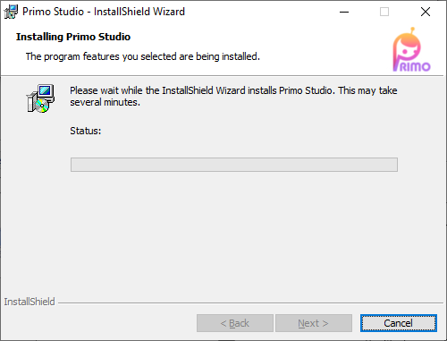

# Installation and startup

The installation of the Primo Studio application is performed by an installer, which is run by the setup.exe file. In order for Primo Studio to work correctly, it requires Microsoft.NET Framework 4.6.1, which is installed together with the studio.

.png>)

.png>)

Once the installer is started, the user will see a standard welcome window.

.png>)

After clicking Next, the installer will propose to choose a folder to install Primo Studio, as well as the one of the following installation options: for all users of the operating system or only for the current one.

.png>)

After clicking Next, the installer will ask you to confirm the start of installation.

.png>)

.png>)

The last screen of the installer informs that the installation of the distribution has been completed successfully.

.png>)

You can launch the Primo Studio application either via a link on your desktop,

.png>)

or via the Start menu: Primo -> Primo Studio.

After launching the application, a registration window will appear.

.png>)

If this window is closed, the studio will also be closed. In order to register, you should click the "Request key" button. The text that appears on the screen should be sent to the vendor at [help@rondem.ru](mailto:help@rondem.ru) to receive a license key (a file with the \*.license extension). You should upload the received file to the system by clicking the "Upload the key" button and then specify the received file in the appeared dialog box. If successful, the registration window will close and you will be able to proceed with using the studio.
